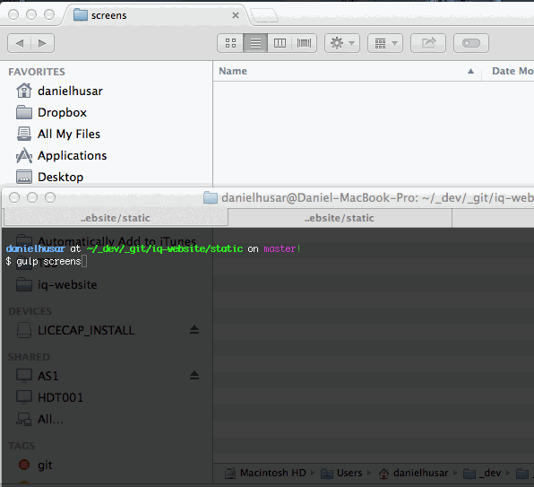

# [gulp](http://gulpjs.com)-local-screenshots [](http://travis-ci.org/danielhusar/gulp-local-screenshots)

This plugin will make the screenshots of your static html files using phantomjs.
(make sure you have phantomjs installed on your machine)


## Install

```
npm install --save-dev gulp-local-screenshots
```

## Example

```javascript
var gulp = require('gulp');
var localScreenshots = require('gulp-local-screenshots');

gulp.task('screens', function () {
  gulp.src('./public/*.html')
  .pipe(localScreenshots({
    width: ['1600', '1000', '480', '320']
   }))
  .pipe(gulp.dest('./public/'));
});
```

## Options


#### path

Type: `String`  
Default: 'public/'

Path from which the static files are served (Trailing slash at the end is required.)


#### port

Type: `Number`  
Default: '8080'

Port for the static web server

#### width

Type: `Array`  
Default: ['1024']

Array of page widths to make screenshots (for the responsive website)

#### height

Type: `String`  
Default: '10'

Height of the page, if the actual page heights is more than that it, iamge will have actual page height.
(specifing height is good for testing)

#### type

Type: `String`  
Default: 'jpg'

Output image extension

#### folder

Type: `String`  
Default: 'screens'

Folder where to put images

#### timeout

Type: `Number`  
Default: '200'

Timeout between files, in most cases you dont need to change that

#### protocol

Type: `String`  
Default: 'http'

Protocol that will be used in phantom.js

#### host

Type: `String`  
Default: 'localhost'

Host that will be used in phantom.js

#### server

Type: `Boolean`  
Default: 'true'

If plugin should start local web server (otherwise you should start your web server by yourself, or specify host option for some remote server)

#### zoom

Type: `Number`  
Default: '1'

Zoom level to set the phantom.js browser viewport. Can be used to take 2x, 3x, etc. screen shots. Widths, heights and output file name remain as specified, but the resulting image will be * 'zoom' pixels. E.g. specify 320 width, zoom level 2: output file will be 320px of page content, but at twice the resolution (640px wide).

#### suffix

Type: `String`  
Default: 'false'

A custom suffix for output file name, you can use -thumb, -shot, etc. And the output file will named source-file-name + custom-suffix. If no suffix set, will use default suffix.

## Demo



## License

MIT © [Daniel Husar](https://github.com/danielhusar)
